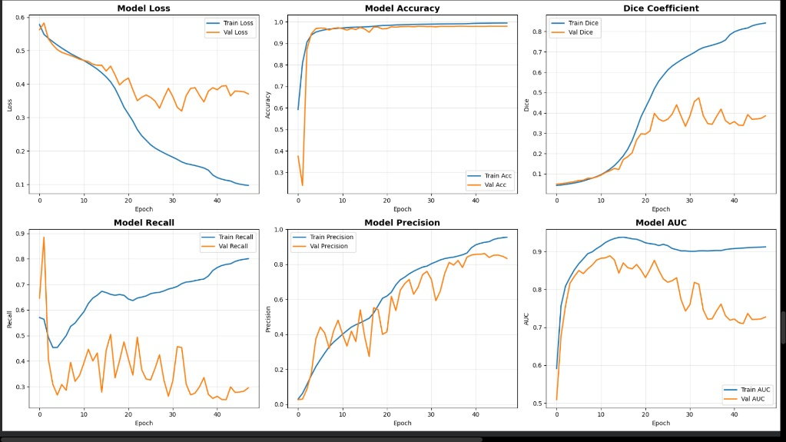
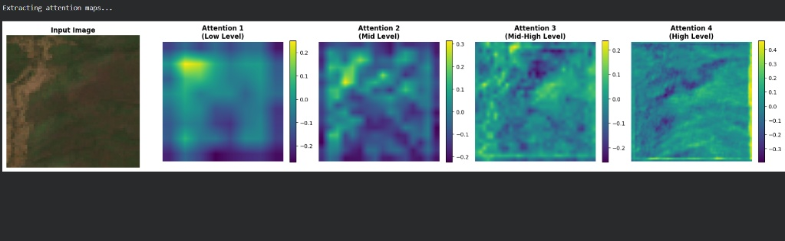
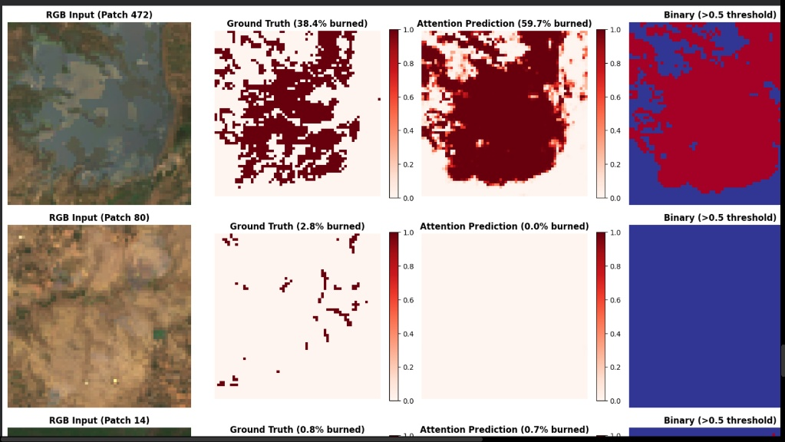
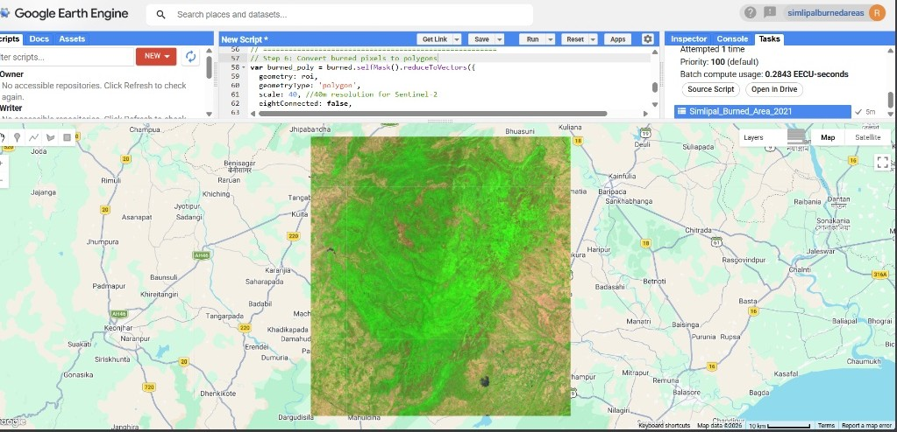

# 🛰️ Automated Burn Scar Delineation: Similipal UNESCO Biosphere Reserve
**Reeva Kanakhara** | **Internship: India Space Academy (ISA)**

## 🔍 Project Overview
This research establishes a technically grounded framework for the automated detection and mapping of burned forest areas within the **Similipal UNESCO Biosphere Reserve**, Odisha, following the 2021 wildfire event. The study addresses the limitations of traditional pixel-based spectral indices in rugged terrains where topographical shadows and dense deciduous canopies introduce significant noise.

## 🛠️ Hybrid Methodology (RS + GIS + AI)
The project implements a three-tier workflow to achieve high-precision results:
1. **Cloud Preprocessing (GEE)**: Utilized Google Earth Engine to process Sentinel-2 multispectral imagery, resampled to **40m spatial resolution** to balance GPU memory optimization with regional-scale analysis.
2. **Deep Learning (Attention U-Net)**: Deployed an Attention U-Net architecture that utilizes learnable attention gates to weight salient charcoal signatures while actively suppressing irrelevant background variations.
3. **GIS Synthesis (QGIS)**: Integrated AI-driven predictions into an expanded GIS workflow for the vectorization, spatial analysis, and cartographic presentation of the 2021 fire extent.

---

## 📊 Technical Performance & Visuals

### 📈 Training Metrics & Convergence
The model was trained using a **Hybrid Combined Focal and Dice Loss** function to maximize spatial overlap accuracy. It achieved a **Pixel Accuracy of 97.9%** across the landscape.

### 🧠 Attention Gate Visualization
These internal heatmaps demonstrate the model's progressive ability to focus on burned textural signatures while actively ignoring spectral noise from undisturbed forest canopies.

### 🎯 Segmentation Output (Patch 472)
A qualitative comparison showing the raw RGB input, the ground truth mask (dNBR baseline), and the successful Attention U-Net prediction for a contiguous burn zone.

### 🌍 GIS Pipeline (GEE Workspace)
The Google Earth Engine environment where the `reduceToVectors` algorithm was deployed to convert classified pixels into professional GIS polygons for conservation management.

---

## 🏁 Final Project Statistics (2021 Event)
* **Total Analyzed Area**: 2,750 km²
* **Burned Area Detected**: 325 km²
* **Unburned Area**: 2,425 km²

---

## 🚀 How to Run
1. Click the **"Open in Colab"** button at the top of the `.ipynb` file in this repository.
2. Ensure you have a Google Earth Engine account to authenticate the data fetch.
